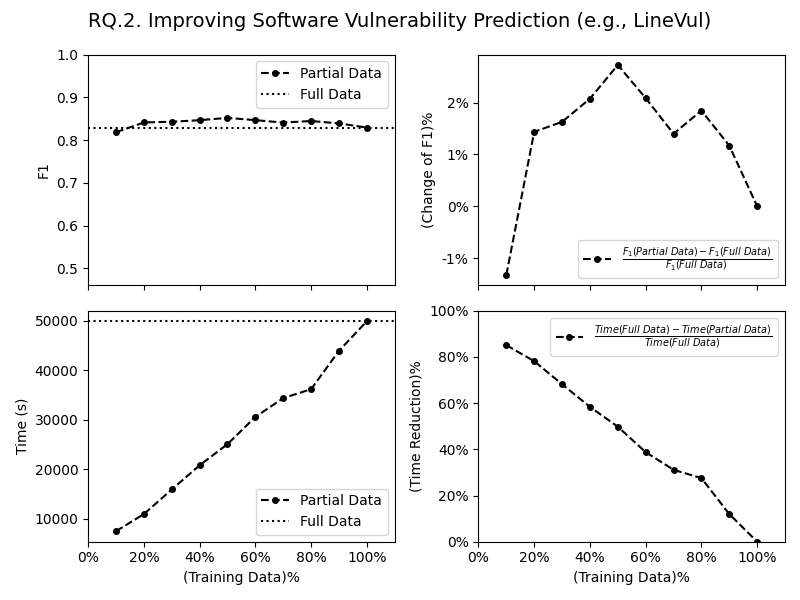

# Quantifying the Uncertainty in Software Vulnerability Patch Data

This repository contains the replication package and supplementary material for the titled research.
To replicate the results in our paper, please examine the experiment environment and the catalog of
the files. With a proper experiment environment and the files downloaded from Dropbox and Google Drive,
you can reproduce the results.

## RQ1

### Selecting UQ Model

This is to study how the UQ model responses to data quality shift. For instance, using VCMatch data, we
go through the train and evaluation phases. 

1. Train the UQ model by running

   ```
   htsc_ps_vcmdata_shift_train.py

   ```
2. Evaluate the UQ model by running
   ```
   htsc_ps_vcmdata_shift_ensemble_eval.py
   ```


### Knowledge vs. Quality

For instance, this is to run
```
hmsc_ps_vcmdata_shift_dvol_test.py
```


## RQ2

### RQ2 Data Curation (SAP and VCMatch)


#### SAP Data
1. Run `htsc_bert_sapdata_active_learn_train_ext.py` to train data curation model using the SAP data.
2. Run `htsc_bert_sapdata_active_learn_eval_ext.py` to evaluate the data curation model.


#### VCMatch Data
1. Run `htsc_ps_vcmdata_active_learn_train_ext.py` to train data curation model using the VCMatch data.
2. Run `htsc_ps_vcmdata_active_learn_eval_ext.py` to evaluate the data curation model.


### RQ2 Software Vulnerability Prediction (LineVul Model)

1. Download the data including selected subset of the data that yields better F1 with far less
   computation time

   [Download data from Google Drive (1.73GB)](https://drive.google.com/file/d/13NVz5rvOUNZkwr_BKvDh3grRZtAYyQ6F/view?usp=sharing)

2. Download the saved model checkpoint (data selection = 50%)

   [Download LineVul model checkpoint (951MB)](https://drive.google.com/file/d/1y1rM4Gx5Sshpy9H74i4v5E_d3nYgrhHt/view?usp=sharing)

3. Obtain LineVul

   [LineVul Github Repository](https://github.com/awsm-research/LineVul.git)

4. Run LineVul inference upon extracting downloaded data and model checkpoint, assuming the data and the model
   checkpoint are extracted under the `linevul` directory in the LineVul repository:

   ```bash
   python linevul_main.py \
    --model_name=model.bin \
    --output_dir=./saved_models_vcm_ehal_max_4 \
    --model_type=roberta \
    --tokenizer_name=microsoft/codebert-base \
    --model_name_or_path=microsoft/codebert-base \
    --do_test \
    --train_data_file=LineVulCommits/splits/random/selection40/vcm_9_linevul_4_ehal_max.pt.csv \
    --eval_data_file=LineVulCommits/splits/random/func_val.csv \
    --test_data_file=LineVulCommits/splits/random/func_test.csv \
    --block_size 512 \
    --eval_batch_size 512
   ```

#### Complete Pipeline
The replication package contains scripts that run the complete pipeline to produce the results for the
figure shown below.





1. Train a UQ model (VCMatch model) using VCMatch data (in c/c++, matching LineVul), run
   ```
   htsc_bert_vcmdata_active_learn_train_ext.py
   ```
2. Select LineVul commit patches ata based on VCMatch model's knowledge and data quality assessment based on UQ:
   ```
   htsc_linevul_activelearn_data_select_retrain.py
   ```
3. Generate function-level data that LineVul requires from the selected LineVul commit patches
   ```
   htsc_linevul_activelearn_train_data_file.py
   ```
4. Train a LineVul data with the generated functional data
5. Test the LineVul model (inference)

<!-- ## Online Supplement

There is a supplementary document to the named research. Find it at in [Dropbox](
https://www.dropbox.com/scl/fi/d2kn6bf901l7x6z1piqy5/main.pdf?rlkey=1apkyxrml2pektw2xd4wzzpzc&dl=0
) -->


## Environment
The programs are written in Python and are tested in several Linux system
distributions. We recommend creating a Python virtual environment to run these
programs, such as
```bash
conda create -n vuldata python=3.9 pip
conda activate vuldata
pip install -r requirements.txt
```
The Python Requirements file is in the replication package.

## Directory Structures
- `data`: data
- `uncertainty/config`: experiment configuration files
- `uncertainty/src`: Python source code
- `uncertainty/scripts`: Shell scripts that run experiments by calling the Python programs

## Scripts and Program Naming Convention
The programs and scripts are written to experiment on combinations of UQ
approaches. These approaches combine data modeling (homoscedastic and heteroscedastic),
UQ estimation (vanilla, Model Ensemble, and Monte Carlo Dropout). We apply these
approaches to two datasets, SAP and VCMatch. For VCMatch dataset, we have two
types of data features, manually-crafted features (PatchScout features) and
embeddings (via CodeBert) while for SAP, we have embeddings. The shellscript
and the Python programs are generally named following the formula:
> ..._(data modeling)_(feature)_(data set)_...

For instance, `run_hmsc_bertsap_gn_shift_train.sh` is a shell script that run
experiment for UQ approach that train UQ model with homoscedastic data modeling
(`hmsc`) with SAP data set (`sap`) using CodeBert features (`bert`).

The script invokes Python program `hmsc_bert_sapdata_shift_train.py` to do the
training. The filename suggests that it train the UQ model with homoscedastic
data modeling (`hmsc`)  with SAP data set (`sapdata`) using CodeBert features
(`bert`).

To run the shell script, follow the help message given by the script:
```bash
run_hmsc_bertsap_gn_shift_train --help
```

To run the Python script, assume you are on the top directory of this repository,
we can retrieve the help message:
```bash
PYTHONPATH=uncertainty/src python uncertainty/src/hmsc_bert_sapdata_shift_train.py --help
```
## File Catalog

## Bash Shell Scripts
In directory `uncertainty/scripts` are the driving Bash shell scripts for the experiments discussed in the paper.
|Name|Data Model|UQ Approximation|Feature|Data|Purpose|
|----|----------|----------------|-------|----|-------|
|run_hmsc_bertsap_gn_shift_train.sh|Homoscedastic|Ensemble                |Embedding |SAP|RQ1: model training|
|run_hmsc_bertsap_gn_shift_eval.sh |             |Ensemble,Dropout,Vanilla|          |   |RQ1: evaluation    |
|run_hmsc_bertvcm_gn_shift_train.sh|             |Ensemble                |          |VCM|RQ1: model training|
|run_hmsc_bertvcm_gn_shift_eval.sh |             |Ensemble,Dropout,Vanilla|          |   |RQ1: evaluation    |
|run_hmsc_psvcm_gn_shift_train.sh  |             |Ensemble                |PatchScout|VCM|RQ1: model training|
|run_hmsc_psvcm_gn_shift_eval.sh   |             |Ensemble,Dropout,Vanilla|          |   |RQ1: evaluation    |
|run_hmsc_psvcm_gn_shift_multiple_train_eval.sh| |Ensemble,Dropout,Vanilla|          |   |RQ1: train/eval multiple times|
|run_htsc_bertsap_gn_shift_train.sh|Heteroscedastic|Ensemble                |Embedding |SAP|RQ1: model training|
|run_htsc_bertsap_gn_shift_eval.sh |               |Ensemble,Dropout,Vanilla|          |   |RQ1: evaluation    |
|run_htsc_bertvcm_gn_shift_train.sh|               |Ensemble                |          |VCM|RQ1: model training|
|run_htsc_bertvcm_gn_shift_eval.sh |               |                        |          |   |RQ1: evaluation    |
|run_htsc_psvcm_gn_shift_train.sh  |               |Ensemble                |PatchScout|VCM|RQ1: model training|
|run_htsc_psvcm_gn_shift_eval.sh   |               |Ensemble,Dropout,Vanilla|          |   |RQ1: evaluation    |
|run_htsc_psvcm_train_eval.sh      |               |Ensemble                |PatchScout|VCM|RQ1/2:model training without quality shift|
|run_hmsc_psvcm_uqdvol.sh          |Homoscedastic  |Ensemble                |PatchScout|VCM|RQ2: quantity of data|
|run_htsc_psvcm_uqdvol.sh          |Heteroscedastic|Ensemble                |PatchScout|VCM|RQ2: quantity of data|
|run_htsc_psvcm_activelearn.sh     |               |Ensemble                |PatchScout|VCM|RQ2: quality of data |
|run_htsc_bertsap_activelearn.sh   |               |Ensemble                |Embedding |VCM|RQ2: quality of data |

### Main Python Programs
The Bash Shell scripts invokes python programs to do its jobs. These main Python
programs are in directory `uncertainty/src/`. We organize these programs in a
way each only depends on a single package in `uqmodel` under directory
`uncertainty/src/uqmodel/`.

|Name|Data Model|UQ Approximation|Feature|Data|Purpose|
|----|----------|----------------|-------|----|-------|
|save_result.py|Any|Any|Any|Any|Saving results on STDOUT to JSON file|
|hmsc_bert_sapdata_shift_train.py        |Homoscedastic |Ensemble |Embedding |SAP|model training  |
|hmsc_bert_sapdata_shift_ensemble_eval.py|              |Ensemble |          |   |model evaluation|
|hmsc_bert_sapdata_shift_dropout_eval.py |              |Dropout  |          |   |                |
|hmsc_bert_sapdata_shift_vanilla_eval.py |              |Vanilla  |          |   |                |
|hmsc_bert_vcmdata_shift_train.py        |              |Ensemble |          |VCM|model training  |
|hmsc_bert_vcmdata_shift_ensemble_eval.py|              |Ensemble |          |   |model evaluation|
|hmsc_bert_vcmdata_shift_dropout_eval.py |              |Dropout  |          |   |                |
|hmsc_bert_vcmdata_shift_vanilla_eval.py |              |Vanilla  |          |   |                |
|hmsc_bert_vcmdata_train.py              |              |Ensemble |          |   |model training without quality shift|
|hmsc_bert_vcmdata_eval.py               |              |Ensemble |          |   |model evaluation                    |
|hmsc_ps_vcmdata_shift_train.py          |              |Ensemble |PatchScout|   |model training  |
|hmsc_ps_vcmdata_shift_ensemble_eval.py  |              |Ensemble |          |   |model evaluation|
|hmsc_ps_vcmdata_shift_dropout_eval.py   |              |Dropout  |          |   |                |
|hmsc_ps_vcmdata_shift_vanilla_eval.py   |              |Vanilla  |          |   |                |
|htsc_bert_sapdata_shift_train.py        |Heteroscedastic|Ensemble |Embedding |SAP|model training  |
|htsc_bert_sapdata_shift_ensemble_eval.py|               |Ensemble |          |   |model evaluation|
|htsc_bert_sapdata_shift_dropout_eval.py |               |Dropout  |          |   |                |
|htsc_bert_sapdata_shift_vanilla_eval.py |               |Vanilla  |          |   |                |
|htsc_bert_vcmdata_shift_train.py        |               |Ensemble |          |VCM|model training  |
|htsc_bert_vcmdata_shift_ensemble_eval.py|               |Ensemble |          |   |model evaluation|
|htsc_bert_vcmdata_shift_dropout_eval.py |               |Dropout  |          |   |                |
|htsc_bert_vcmdata_shift_vanilla_eval.py |               |Vanilla  |          |   |                |
|htsc_ps_vcmdata_shift_train.py          |               |Ensemble |PatchScout|VCM|model training  |
|htsc_ps_vcmdata_shift_ensemble_eval.py  |               |         |          |   |model evaluation|
|htsc_ps_vcmdata_shift_dropout_eval.py   |               |Dropout  |          |   |                |
|htsc_ps_vcmdata_shift_vanilla_eval.py   |               |Dropout  |          |   |                |
|hmsc_ps_vcmdata_shift_dvol_test.py      |Homoscedastic  |Ensemble |PatchScout|   |traing for data volume tests|
|htsc_bert_sapdata_active_learn_test.py  |Heteroscedastic|Ensemble |Embedding |SAP|training data quality tests|
|htsc_bert_sapdata_active_learn_eval.py  |               |         |          |   |evaluation                 |
|htsc_bert_sapdata_active_learn_result.py|               |         |          |   |processing          results|
|htsc_ps_vcmdata_active_learn_test.py    |               |         |PatchScout|VCM|training data quality tests|
|htsc_ps_vcmdata_active_learn_eval.py    |               |         |          |   |evaluation                 |

### Python Packages for UQ Models
The above Python programs rely on the Python packages in directory `uncertainty/src/uqmodel`. We organize
each package to be independent of the others. Because of this, there are duplicated files and subroutines.
However, in this way, changing one wouldn't break long-running experiments done before.

|Package           |Data Model     |UQ Approximation        |Features  |Remark|
|------------------|---------------|------------------------|----------|------|
|ensemble          |Homoscedastic  |Ensemble,Dropout,Vanilla|PatchScout|with/without quality shift|
|bert              |               |                        |Embedding |Without quality shift     |
|shiftbert         |               |                        |          |with quality shift        |
|stochasticensemble|Heteroscedastic|                        |PatchScout|with/without quality shift|
|stochasticbert    |               |                        |Embedding |without quality shift     |
|shiftstochasticbert|              |                        |          |with quality shift        |

<!--
|Purpose|Data Model|UQ Approximation|Feature| Dataset|Shell Script| Main Python Program | Python Package |
|-------|----------|----------------|-------|--------|------------|---------------------|----------------|
| RQ1: Dataset Quality Shift|Homoscedastic|Model Ensemble|PatchScout|VCMatch|run_hmsc_psvcm_gn_shift_train.sh|htsc_ps_vcmdata_shift_train.py|uqmodel.ensemble|
| RQ1: Dataset Quality Shift|Homoscedastic|Monte Carlo Dropout|PatchScout|VCMatch|run_hmsc_psvcm_gn_shift_train.sh|htsc_ps_vcmdata_shift_train.py|uqmodel.ensemble|
| RQ1: Dataset Quality Shift|Homoscedastic|Vanilla|PatchScout|VCMatch|run_hmsc_psvcm_gn_shift_train.sh|hmsc_ps_vcmdata_shift_train.py|uqmodel.ensemble|
| RQ1: Dataset Quality Shift|Heteroscedastic|Model Ensemble|PatchScout|VCMatch|run_htsc_psvcm_gn_shift_train.sh|hmsc_ps_vcmdata_shift_train.py|uqmodel.ensemble|
| RQ1: Dataset Quality Shift|Heteroscedastic|Monte Carlo Dropout|PatchScout|VCMatch|run_htsc_psvcm_gn_shift_train.sh|hmsc_ps_vcmdata_shift_train.py|uqmodel.ensemble|
| RQ1: Dataset Quality Shift|Heteroscedastic|Vanilla|PatchScout|VCMatch|run_htsc_psvcm_gn_shift_train.sh|htsc_ps_vcmdata_shift_train.py|uqmodel.ensemble|
| RQ1: Dataset Quality Shift|Homoscedastic|Model Ensemble|CodeBert|VCMatch|run_bert_bertvcm_gn_shift_train.sh|htsc_bert_vcmdata_shift_train.py|uqmodel.ensemble|
| RQ1: Dataset Quality Shift|Homoscedastic|Monte Carlo Dropout|CodeBert|VCMatch|run_hmsc_bertvcm_gn_shift_train.sh|htsc_bert_vcmdata_shift_train.py|uqmodel.ensemble|
| RQ1: Dataset Quality Shift|Homoscedastic|Vanilla|CodeBert|VCMatch|run_hmsc_bertvcm_gn_shift_train.sh|htsc_bert_vcmdata_shift_train.py|uqmodel.ensemble|
| RQ1: Dataset Quality Shift|Heteroscedastic|Model Ensemble|CodeBert|VCMatch|run_htsc_bertvcm_gn_shift_train.sh|htsc_bert_vcmdata_shift_train.py|uqmodel.ensemble|
| RQ1: Dataset Quality Shift|Heteroscedastic|Monte Carlo Dropout|CodeBert|VCMatch|run_htsc_bertvcm_gn_shift_train.sh|htsc_bert_vcmdata_shift_train.py|uqmodel.ensemble|
| RQ1: Dataset Quality Shift|Heteroscedastic|Vanilla|CodeBert|VCMatch|run_htsc_bertvcm_gn_shift_train.sh|htsc_bert_vcmdata_shift_train.py|uqmodel.ensemble|
| RQ1: Dataset Quality Shift|Homoscedastic|Model Ensemble|CodeBert|SAP|run_bert_bertsap_gn_shift_train.sh|htsc_bert_sapdata_shift_train.py|uqmodel.ensemble|
| RQ1: Dataset Quality Shift|Homoscedastic|Monte Carlo Dropout|CodeBert|SAP|run_hmsc_bertsap_gn_shift_train.sh|htsc_bert_vcmdata_shift_train.py|uqmodel.ensemble|
| RQ1: Dataset Quality Shift|Homoscedastic|Vanilla|CodeBert|SAP|run_hmsc_bertsap_gn_shift_train.sh|htsc_bert_sapdata_shift_train.py|uqmodel.ensemble|
| RQ1: Dataset Quality Shift|Heteroscedastic|Model Ensemble|CodeBert|SAP|run_htsc_bertsap_gn_shift_train.sh|htsc_bert_sapdata_shift_train.py|uqmodel.ensemble|
| RQ1: Dataset Quality Shift|Heteroscedastic|Monte Carlo Dropout|CodeBert|SAP|run_htsc_bertsap_gn_shift_train.sh|htsc_bert_sapdata_shift_train.py|uqmodel.ensemble|
| RQ1: Dataset Quality Shift|Heteroscedastic|Vanilla|CodeBert|SAP|run_htsc_bertsap_gn_shift_train.sh|htsc_bert_sapdata_shift_train.py|uqmodel.ensemble| -->
